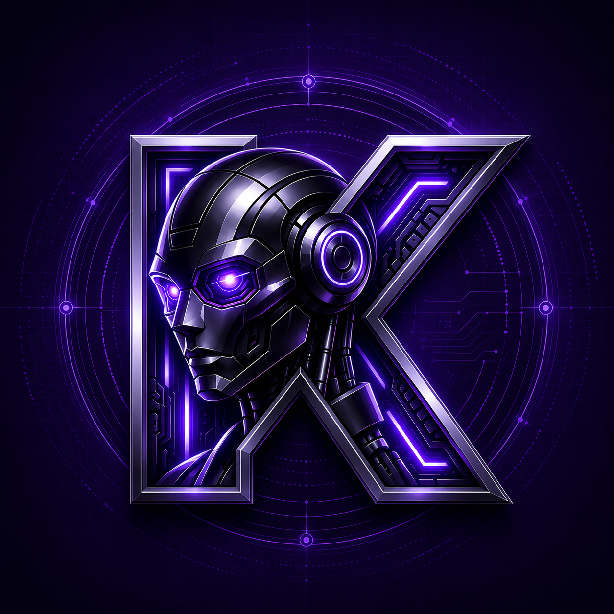

<div align="center">

  

  # KARA AI 🤖
  ### **Autonomous Multi-Agent Startup Engine**

  *Transform raw business ideas into production-grade full-stack applications, market analytics, financial models, and execution roadmaps in seconds.*

  <p align="center">
    <a href="https://ai.google.dev"></a>
    <a href="#-autonomous-agent-workforce"></a>
    <a href="#-autonomous-agent-workforce"></a>
    <a href="https://nextjs.org"></a>
    <a href="https://fastapi.tiangolo.com"></a>
    <a href="https://www.docker.com"></a>
    <a href="https://github.com/jaymore4501/KARA/actions/workflows/ci.yml"></a>
    <a href="https://github.com/jaymore4501/KARA/blob/main/LICENSE"></a>
  </p>

  <p align="center">
    <a href="#-key-features">Key Features</a> •
    <a href="#-autonomous-agent-workforce">Agent Workforce</a> •
    <a href="#-system-architecture--flow">System Architecture</a> •
    <a href="#-quick-start">Quick Start</a> •
    <a href="#-api-reference">API Reference</a>
  <p align="center">
    
  </p>

  ---
</div>

## 🌟 Overview

**KARA** is an enterprise-grade **Autonomous Multi-Agent System** engineered to automate the end-to-end lifecycle of startup creation and software product development. By orchestrating a specialized swarm of AI agents, KARA takes high-level prompt inputs (e.g., *"Real estate contract AI compiler"*) and autonomously performs market analysis, designs software architecture, synthesizes production code, generates financial runways, and prepares launch portfolios.

Designed with a **dark-mode cyberpunk aesthetic**, KARA features an interactive 3D parallax HUD core, real-time dynamic timeline progression, and structured execution telemetry.

---

## ✨ Key Features

- **🧠 Swarm Multi-Agent Engine:** Coordinated AI roles working in parallel (CEO, Architect, Data Scientist, UX Lead).
- **⚡ Real-Time Pipeline Telemetry:** Dynamic timeline tracking sub-millisecond execution status across all nodes.
- **🎨 3D Interactive Parallax HUD:** High-fidelity mouse parallax core visualization built with Vanilla CSS and React.
- **🛠️ Production-Grade Full Stack Code Generation:** Instant synthesis of clean, modular Next.js frontend and FastAPI backend code.
- **📊 Financial & Market Intelligence:** Automated TAM/SAM calculation, unit economics breakdown, and competitive positioning matrix.
- **🛡️ Enterprise Security & Sandboxing:** Isolated execution runtime with CORS control, rate limiting, and strict input validation.

---

## 🤖 Autonomous Agent Workforce

KARA delegates tasks across specialized autonomous agent personas operating in parallel:

| Agent Logo | Persona & Role | Key Responsibilities | Primary Output |
| :---: | :--- | :--- | :--- |
| 👑 | **Nova** <br> *(CEO & Strategy Lead)* | Strategic visioning, dynamic agent delegation, roadmap decisions | Executive Summary & GTM Strategy |
| 🔍 | **Atlas** <br> *(Market Research)* | Deep intelligence crawling, TAM/SAM estimation, competitor sentiment | Market Intelligence & Segment Matrix |
| 📋 | **Pulse** <br> *(Product Manager)* | PRD document autogeneration, agile epic mapping, feature value scoring | PRD Specifications & Sprint Backlog |
| 🏗️ | **Forge** <br> *(Software Architect)* | System architecture design, database schema modeling, OpenAPI contracts | Schema Files & System Blueprints |
| 💻 | **CodeX** <br> *(Backend Engineer)* | FastAPI & Node.js service development, SQL migrations, unit testing | Modular Backend & API Services |
| ⚡ | **Flux** <br> *(Frontend Engineer)* | Component compilation, client state hooks, responsive UI assemblies | Production React/Next.js Client |
| 🎨 | **Aura** <br> *(UI/UX Designer)* | Dark cosmic visual themes, typography frameworks, layout presets | Design Tokens & Wireframe Presets |
| 📢 | **Echo** <br> *(Marketing Strategist)* | SEO positioning blueprints, ad copy autowriting, launch campaign sequencing | Launch Campaign & Social Assets |
| 📊 | **Ledger & Vertex** <br> *(Finance & Investor Lead)* | COGS engine calculation, SaaS pricing yield, runway burn projections | Pitch Deck Slides & Financial Model |

---

## 🔄 System Architecture & Flow

  


### ⚡ Step-by-Step Execution Pipeline:
1. **Idea Ingestion:** User inputs raw product vision or business domain idea.
2. **Context Resolution:** Swarm analyzes requirements against historical data and web domain taxonomies.
3. **Strategic Blueprinting (Nova):** Constructs value propositions, target user personas, and monetization strategies.
4. **Architectural Synthesis (Forge):** Compiles database schemas, REST routes, and client-side component trees.
5. **Financial & Growth Modeling (Pulse):** Calculates CAC, LTV, projected MRR growth, and break-even timelines.
6. **Workspace Deployment:** Generates downloadable project archives and real-time execution dashboards.

---

## 📁 Repository Structure

```text
KARA/
├── backend/                  # FastAPI Backend Application
│   ├── app/
│   │   ├── main.py           # FastAPI entrypoint & router definitions
│   │   ├── config.py         # App configuration & env parameters
│   │   ├── models/           # Pydantic data schemas & DB models
│   │   ├── routers/          # API route handlers (/projects, /agents)
│   │   └── services/         # Multi-agent execution engine logic
│   ├── requirements.txt      # Python dependencies
│   └── pyproject.toml        # uv configuration manifest
│
├── frontend/                 # Next.js 16 (Turbopack) Application
│   ├── public/               # Static assets & brand logos
│   │   ├── HERO-Logo.png     # Official KARA full-coverage brand logo
│   │   └── ROBOT_HERO_IMG.png# Core 3D Robot visualization asset
│   ├── src/
│   │   ├── app/              # Next.js App Router (pages & layouts)
│   │   └── components/
│   │       ├── dashboard/    # Workspace execution dashboard
│   │       └── marketing/    # Landing page, 3D HolographicCore, Timeline
│   ├── package.json          # Node dependencies & scripts
│   └── tailwind.config.ts    # Custom dark cyber design system tokens
│
└── README.md                 # Project documentation
```

---

## 🚀 Quick Start

### Prerequisites

Ensure you have the following installed on your machine:
- **Node.js** v18.0.0 or higher
- **Python** v3.11 or higher
- **uv** (Recommended Python package manager) or `pip`

---

### 1. Clone the Repository

```bash
git clone https://github.com/jaymore4501/KARA.git
cd KARA
```

---

### 2. Backend Setup (FastAPI)

Navigate to the `backend` directory and set up the Python environment:

```bash
cd backend

# Create virtual environment and install dependencies using uv (or pip)
uv sync

# Create environment configuration file
cp .env.example .env
```

Add your **Google Gemini API Key** inside `.env`:
```env
GEMINI_API_KEY=your_gemini_api_key_here
PORT=8000
DATABASE_URL=sqlite:///./kara_workspace.db
```

Launch the FastAPI Uvicorn server:
```bash
uv run uvicorn app.main:app --host 127.0.0.1 --port 8000 --reload
```
> Server will start at **`http://127.0.0.1:8000`** (Swagger docs available at `http://127.0.0.1:8000/docs`).

---

### 3. Frontend Setup (Next.js)

In a new terminal window, navigate to the `frontend` directory:

```bash
cd frontend

# Install Node dependencies
npm install

# Run the development server with Turbopack
npm run dev
```
> Next.js frontend will be live at **`http://localhost:3000`**.

---

## 📡 API Reference

### Projects Endpoint

| Method | Endpoint | Description |
| :--- | :--- | :--- |
| `POST` | `/api/v1/projects` | Initialize a new multi-agent startup generation workspace |
| `GET` | `/api/v1/projects` | List all active and archived projects |
| `GET` | `/api/v1/projects/{id}` | Retrieve full details, code structure, and agent outputs |
| `DELETE` | `/api/v1/projects/{id}` | Remove a project workspace |

### Agents Endpoint

| Method | Endpoint | Description |
| :--- | :--- | :--- |
| `GET` | `/api/v1/agents` | List status, capabilities, and telemetry of all AI agents |
| `POST` | `/api/v1/agents/execute` | Dispatch custom single-agent execution tasks |

---

## 🎨 Design System & Aesthetics

KARA follows a **Curated Cyberpunk Aesthetic**:
- **Backgrounds:** Pitch Obsidian (`#09070F`), Surface Card (`#171522`)
- **Primary Accents:** Neon Violet (`#9D6CFF`), Cyber Purple (`#7C5CFF`)
- **Status Indicators:** Emerald Active (`#34D399`), Cyan Processing (`#38BDF8`)
- **Typography:** Inter & Outfit modern geometric font pairings

---

## 📜 License

Distributed under the **MIT License**. See [LICENSE](LICENSE) for more information.

---

<div align="center">
  <sub>Built with ❤️ by the KARA AI Engineering Team. Powered by Google Gemini 3.5.</sub>
</div>
